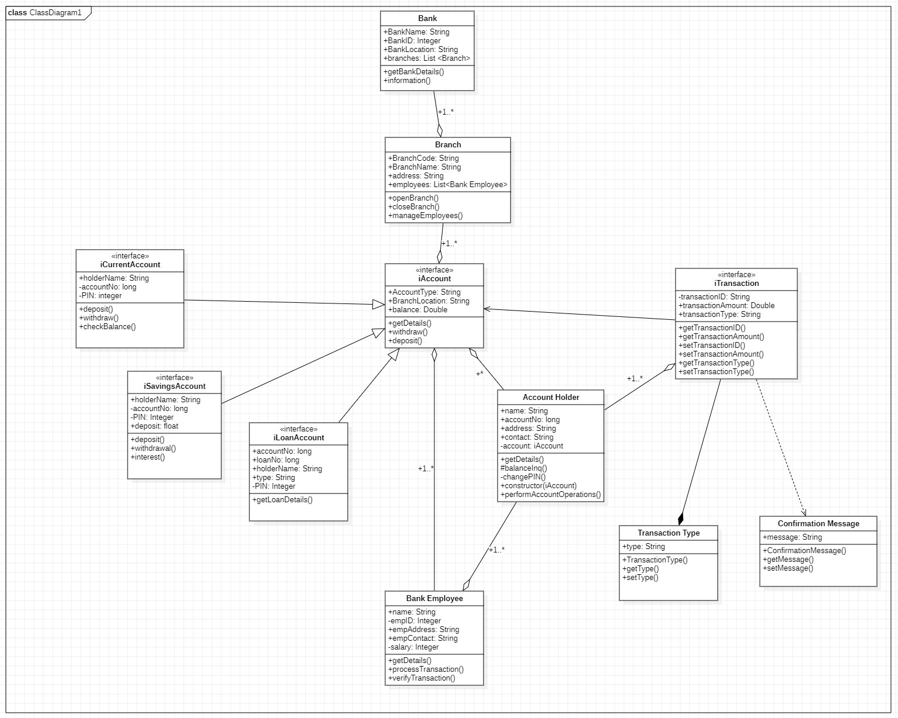

## Bank Management System

This is a simple application implemented in Java and Spring Boot, allowing users to perform various banking operations such as creating accounts, depositing money, withdrawing money, and transferring money between accounts.

### Features

Account Creation: 
- Users can create new bank accounts with unique account numbers and associated details.

Deposit Money: 
- Users can deposit money into their accounts, increasing their account balance.

Withdraw Money: 
- Users can withdraw money from their accounts, decreasing their account balance.

Transfer Money: 
- Users can transfer money between their own accounts or to other users' accounts.

Account Management: 
- Users can view their account details, including account number, balance, and transaction history.

## Technologies Used

- Java
- Spring Boot
- MySQL
- Hibernate
- Maven

## Getting Started

1. Clone the repository:
    ```
    git clone https://github.com/anooshd7/Bank-Management-System-Java-Spring.git
    ```

2. Configure MySQL database:
    - Create a MySQL database named 'banking_app'.
    - Update the database configurations in the `application.properties` file with your MySQL username and password.

3. Run the application:
    ```
    mvn spring-boot:run
    ```

## Class Diagram



## UML Diagram


